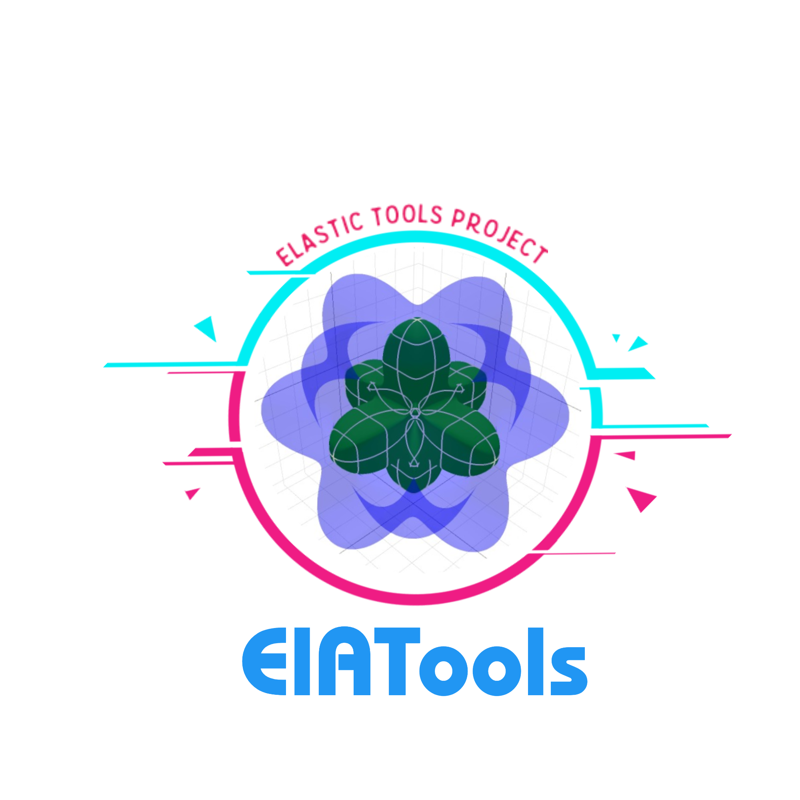
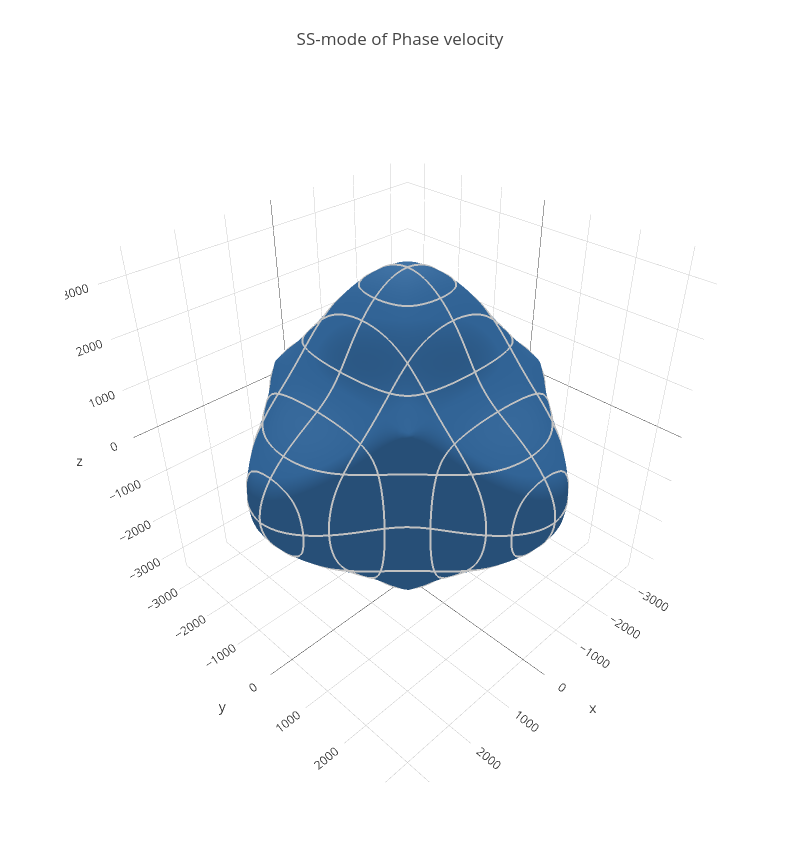
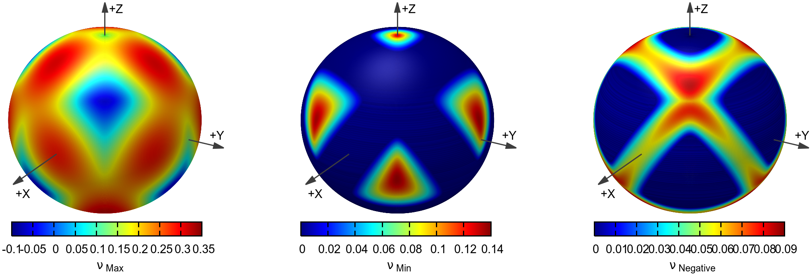

<h4 align="center">Visitors :eyes:</h4>

<p align="center">
 
</p>

# ElATools [](https://yalameha.gitlab.io/elastictools/index.html) [](https://groups.google.com/g/elatools) 

<p align="center">
   
  
  
  
  
  
   

</p>  

## _A tool for analyzing anisotropic elastic properties of the 2D and 3D materials_

**Google group:** https://groups.google.com/g/elatools?pli=1

[](https://github.com/shahramyalameha/ElATools/blob/main/LICENSE.md)
[](https://github.com/shahramyalameha/ElATools/releases/latest)
[](https://github.com/shahramyalameha/ElATools/issues) 
[](https://github.com/shahramyalameha/ElATools/network)
[](https://github.com/shahramyalameha/ElATools/stargazers)


> We introduce a computational method and a user-friendly code with a terminal-based graphical user interface (GUI), named ElATools, developed to analyze anisotropic elastic properties. ElATools enables facile analysis of the second-order elastic stiffness tensor of two-dimensional (2D) and three-dimensional (3D) crystal systems. It computes and displays the main mechanical properties including the bulk modulus, Young’s modulus, shear modulus, hardness, p-wave modulus, universal anisotropy index, Chung-Buessem anisotropy index, log-Euclidean anisotropy parameter, Cauchy pressures, Poisson's ratio, and Pugh's ratio, using three averaging schemes of Voigt, Reuss, and Hill. It includes an online and offline database from the Materials Project with more than 13,000 elastic stiffness constants for 3D materials. The program supports output files of the well-known computational codes IRelast, IRelast2D, ElaStic, and AELAS. Four types of plotting and visualization tools are integrated to conveniently interface with GNUPLOT, XMGRACE, view3dscene and plotly libraries, offering immediate post-processing of the results. ElATools provides reliable means to investigate the mechanical stability based on the calculation of six (three) eigenvalues of the elastic tensor in 3D (2D) materials. It can efficiently identify anomalous mechanical properties, such as negative linear compressibility, negative Poisson’s ratio, and highly-anisotropic elastic modulus in 2D and 3D materials, which are central properties to design and develop high-performance nanoscale electromechanical devices. Moreover, ElATools can predict the behavior of the sound velocities and their anisotropic properties, such as acoustic phase/group velocities and power flow angles in materials, by solving the Christoffel equation.

Please cite the following articles if you use ElATools for your research:

- [Shahram Yalameha, Zahra Nourbakhsh and Daryoosh Vashaee; Computer Physics Communications 271 (2022): 108195.](https://www.sciencedirect.com/science/article/pii/S0010465521003076)

BibTeX:


```
 @article{yalameha2021elatools,
 title = {ElATools: A tool for analyzing anisotropic elastic properties of the 2D and 3D materials},
 journal = {Computer Physics Communications},
 volume = {271},
 pages = {108195},
 year = {2022},
 issn = {0010-4655},
 doi = {https://doi.org/10.1016/j.cpc.2021.108195},
 url = {https://www.sciencedirect.com/science/article/pii/S0010465521003076},
 author = {Shahram Yalameha and Zahra Nourbakhsh and Daryoosh Vashaee}
}
 
```


>>>The code is open-source (licensed with a GPLv3 license, see LICENSE file).

Please use ElATools instead of "ela_tools" , "Ela-tools" or Elatools" when you cite our software.


## Features
The following features of ElATools are highlighted:
- **3D Elastic Properties of 3D materials:**
   - Bulk modulus   
   - Shear modulus  
   - Young's modulus  
   - P-wave modulus 
   - Poisson's ratio 
   - Pugh ratio    
   - Universal anisotropy index (AU)      
   - Log-Euclidean anisotropy parameter (AL)
   - Chung-Buessem Anisotropy Index (Ac)   
   - Cauchy pressure (Pc) 
   - Kleinman parameter **New**
   - Lame’s first and second parameters **New**
   - Hardness information **New**

- **Elastic Properties of 2D materials:**
   - Young modulus  
   - Poisson's ratio
   - Shaer modulus
   - Area modulus
   - Elastic anisotropy index (A_SU)
   - Ranganathan Elastic anisotropy index (A_Ra)  
   - Kube Elastic anisotropy index (A_Kube)
   
- **Visualization of 3D materials:**
   - 3D representation of Bulk modulus (testing)  
   - 3D representation of Shear modulus (tested) 
   - 3D representation of Linear Compressibiliy (tested) 
   - 3D representation of Young modulus  (tested) 
   - 3D representation of Poisson's ratio (tested)
   - 3D representation of Hardness (testing) **New**
   - 3D representation of Pugh ratio (testing)
   - 3D representation of Phase velocity_P, Fast and slow modes (tested) **New**
   - 3D representation of Group velocity_P, Fast and slow modes (tested)  **New**
   - 3D representation of Power flow angle_P, Fast and slow modes (tested) **New**  
   - 2D Heat map of Bulk modulus (testing)  **New**
   - 2D Heat map of Shear modulus (tested) **New**
   - 2D Heat map of Linear Compressibiliy (tested) **New**
   - 2D Heat map of Young modulus  (tested) **New**
   - 2D Heat map of Poisson ratio (tested) **New**
   - 2D Heat map of Hardness (testing) **New**
   - 2D Heat map of Pugh ratio (testing) **New**
   - 2D Heat map of Phase velocity_P, Fast and slow modes (tested) **New**
   - 2D Heat map of Group velocity_P, Fast and slow modes (tested)  **New**
   - 2D Heat map of Power flow angle_P, Fast and slow modes (tested) **New** 

- **Visualization of 2D materials:**
   - 2D representation of Young’s modulus  (tested) 
   - 2D representation of Poisson's ratio (tested) 
   - 2D representation of Shear modulus (tested) **New**
 
- **Interfaces to**
   - IRelast code in WEIN2k (For 3D system)
   - IRelast2D code in WEIN2k (For 2D system) **New**      
   - Elast code in WEIN2k (For 3D system)
   - AELAS code for VASP (For 2D and 3D systems)
   - ElaStic code for QE, WEIN2k and Exciting (For 3D systems) **New**

- **A offline/online database with more than 13000 elastic constants (Cij) for 3D materials (from Materials Project).**
- **Supports different symmetries**
   - Cubic
   - Hexagonal
   - Tetragonal
   - Orthorhombic
   - Rhombohedral
   - Monoclinic

- **Checks stability conditions**
   - Stability conditions of 3D systems
   - Stability conditions of 2D systems
   
- **Supports various output files for visualizing data**
   - wrl
   - agr 
   - gnu 
   - dat
   - html **new**  v1.7.0 and later
## Installation
You need to install the following packages:

* Fortran compiler (Ifort v19 and later (Recom.) or gfortran v9.4.0  )
* Lapack and Blas library

Compilation
-----------

The db directory contains the elastic constant database file. The path of these files must be specified before installation. For this purpose, you can use run_path.sh script to path
these files. This script is located in the soc directory and runs as follows:

chmod +x run_path.sh ; ./run_path.sh

Then you need the complete path (example: /home/.../soc/db/ ) of the elastic constant database files (Cijs.binery and All_2ID_cop.csv) in the db directory, which is different for
the user system.

Then Go into ElATools-v*.*.*/soc directory, Choose and Edit Makefile, Change the blas library ” libs= ” to your lapack+blas library
After the compliation (run **make all ** in soc), the binary ‘Elatools.x , dat2wrl.x, dat2gnu.x and dat2agr.x’ are copied to Elatools.x /bin/, you can put this path to the system PATH with
::

 export PATH=/where/you/downloaded/ElaTools-v*.*.*/bin:$PATH

to the **.bashrc** file in your home directory.

**Note:** If you are using the ifort compiler with version 13, replace the option **-qopenmp** with option **-openmp**.

Usage
-----

Now you can enjoy your exploration for materials with ElATools.
There is a file you need to prepare,

* For IRelast code **INVELC-matrix** file,
* For Elast code **elast.output** file,
* For AELAS code **ELADAT** file,
* For any code **Cij.dat/Cij-2D.dat** tensor file.

After the preparation of this file, you can just run Elatools.x  in the same folder
::

  Elatools.x 

For 3D representation of properties:
::

  dat2wrl.x

  dat2html.x
  
For 2D representation of properties:
::

  data2gnu.x
and 
::

  dat2agr.x

Plotting tools
--------------

   - `Gnuplot <http://gnuplot.sourceforge.net/>`_
   - `Xmgrace <http://plasma-gate.weizmann.ac.il/Grace/>`_
   - `Titania <http://create3000.de/>`_
   - `Meshlab <http://www.meshlab.net/>`_
   - `View3dscene <https://castle-engine.io/view3dscene.php>`_
   
