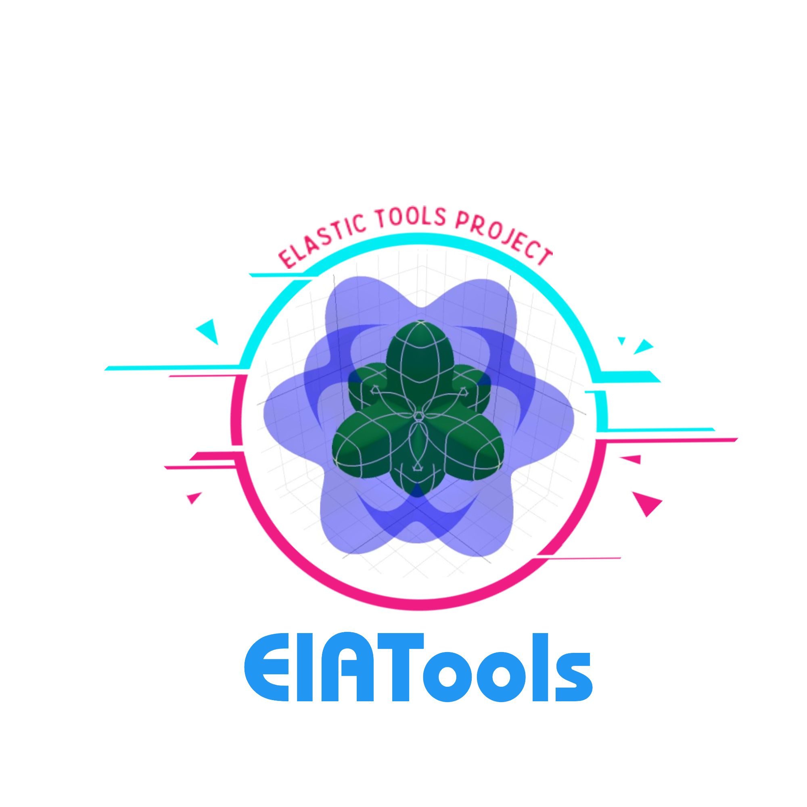
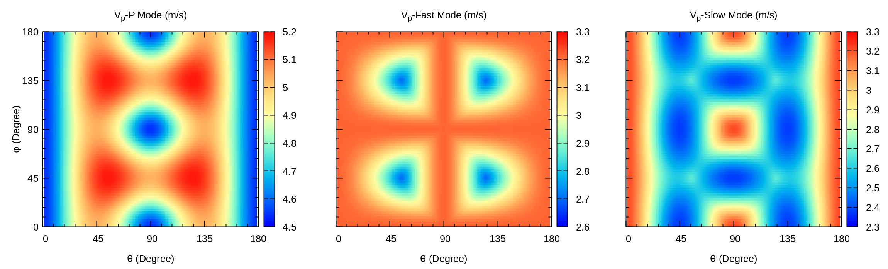
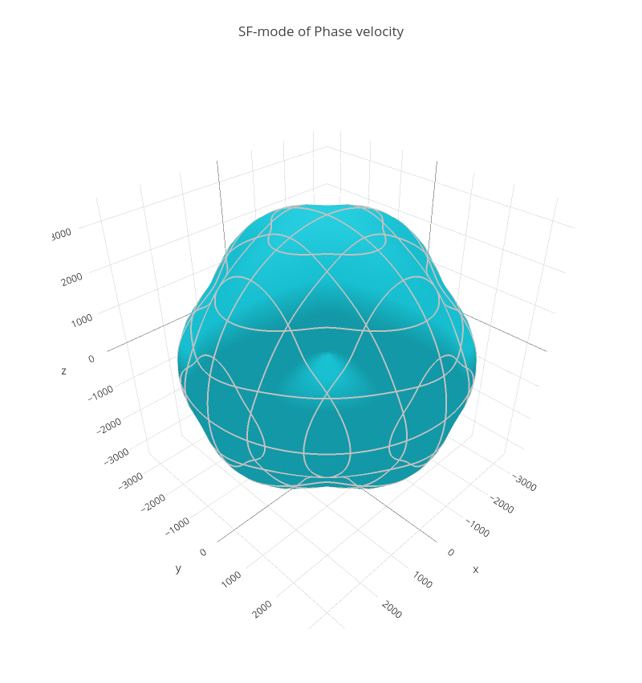
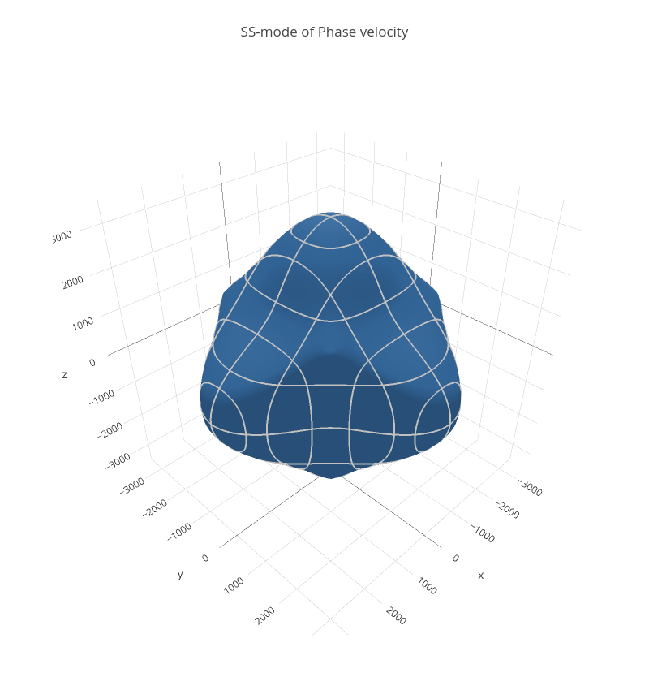
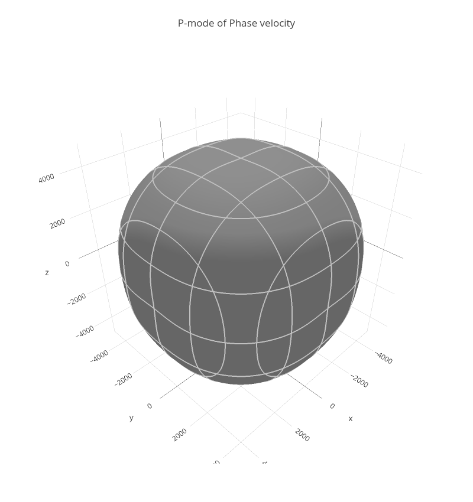
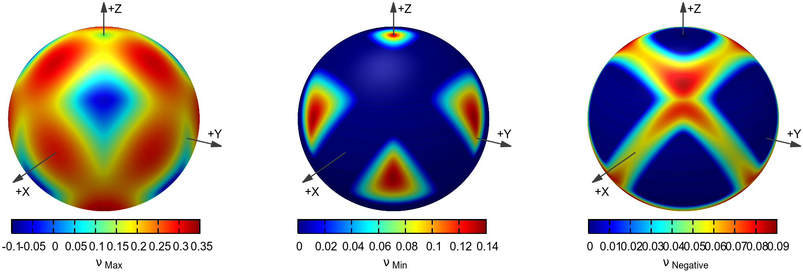

# ElATools

[](https://yalameha.gitlab.io/elastictools/index.html)
[](https://groups.google.com/g/elatools)
[](https://github.com/shahramyalameha/ElATools/releases)
[](https://github.com/shahramyalameha/ElATools/blob/main/LICENSE.md)
[](https://github.com/shahramyalameha/ElATools/releases/latest)
[](https://github.com/shahramyalameha/ElATools/issues)
[](https://github.com/shahramyalameha/ElATools/stargazers)


Plese visit our official [Website](https://yalameha.gitlab.io/elastictools/index.html) or join the [Google Group](https://groups.google.com/g/elatools) for discussions.

<p align="center">
  <br>
  <br>
  
  
  <br>
  
</p>

## *A tool for analyzing anisotropic elastic properties of 2D and 3D materials*

> **Abstract:** We introduce a computational method and a user-friendly code with a terminal-based graphical user interface (GUI), named **ElATools**, developed to analyze anisotropic elastic properties. ElATools enables facile analysis of the second-order elastic stiffness tensor of two-dimensional (2D) and three-dimensional (3D) crystal systems. It computes and displays the main mechanical properties including the bulk modulus, Young’s modulus, shear modulus, hardness, p-wave modulus, universal anisotropy index, Chung–Buessem anisotropy index, log-Euclidean anisotropy parameter, Cauchy pressures, Poisson's ratio, and Pugh's ratio, using three averaging schemes: Voigt, Reuss, and Hill. It includes an online and offline database from the Materials Project with more than 13,000 elastic stiffness constants for 3D materials. The program supports output files of the well-known computational codes IRelast, IRelast2D, ElaStic, and AELAS. Four types of plotting and visualization tools are integrated to conveniently interface with GNUPLOT, XMGRACE, view3dscene, and Plotly libraries, offering immediate post-processing of the results. ElATools provides reliable means to investigate mechanical stability based on the calculation of six (three) eigenvalues of the elastic tensor in 3D (2D) materials. It can efficiently identify anomalous mechanical properties, such as negative linear compressibility, negative Poisson’s ratio, and highly-anisotropic elastic moduli in 2D and 3D materials, which are central properties to design and develop high-performance nanoscale electromechanical devices. Moreover, ElATools can predict the behavior of sound velocities and their anisotropic properties, such as acoustic phase/group velocities and power flow angles in materials, by solving the Christoffel equation.

### License & Citation
The code is open-source and licensed under the **GPLv3 License** (see the `LICENSE` file). 

Please use **ElATools** instead of *"ela_tools"*, *"Ela-tools"*, or *"Elatools"* when you cite the software. If you use ElATools for your research, please cite the following article:

* **Shahram Yalameha, Zahra Nourbakhsh, and Daryoosh Vashaee**; *Computer Physics Communications* 271 (2022): 108195. [Digital Object Identifier (DOI)](https://doi.org/10.1016/j.cpc.2021.108195)

**BibTeX:**
```bibtex
@article{yalameha2021elatools,
  title   = {ElATools: A tool for analyzing anisotropic elastic properties of the 2D and 3D materials},
  journal = {Computer Physics Communications},
  volume  = {271},
  pages   = {108195},
  year    = {2022},
  issn    = {0010-4655},
  doi     = {[https://doi.org/10.1016/j.cpc.2021.108195](https://doi.org/10.1016/j.cpc.2021.108195)},
  url     = {[https://www.sciencedirect.com/science/article/pii/S0010465521003076](https://www.sciencedirect.com/science/article/pii/S0010465521003076)},
  author  = {Shahram Yalameha and Zahra Nourbakhsh and Daryoosh Vashaee}
}
